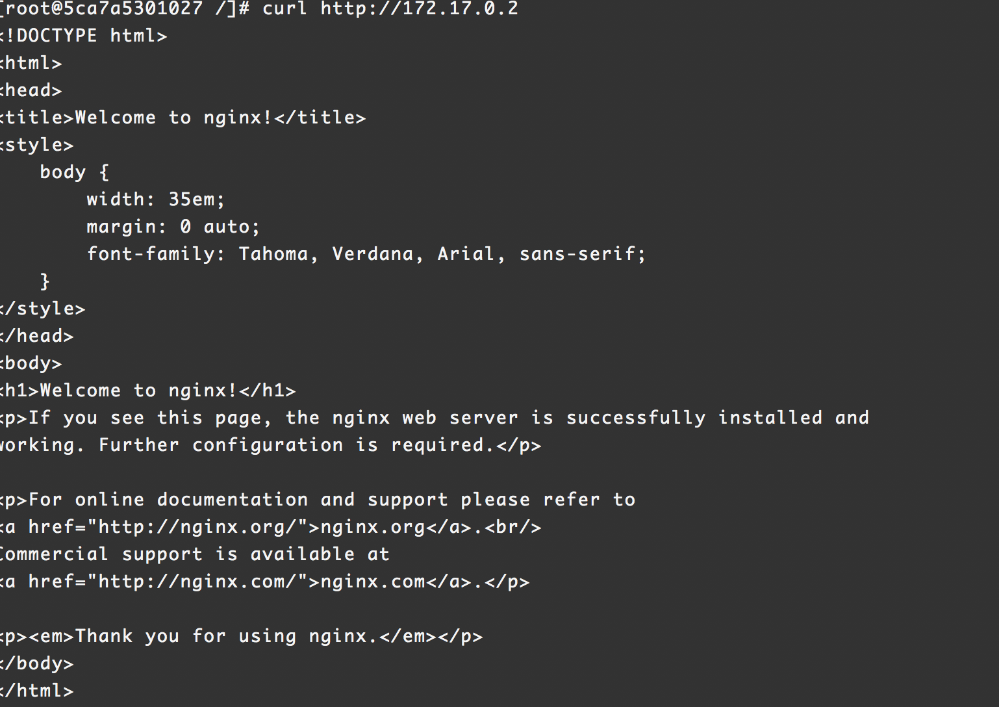

### Network

#### Link name

Docker network mode 有以下四種模式

- Brige (預設)
- Host
- None
- Container

terminal 1
```
## 啟動一個名為web 的nginx container 並拋到背景
# docker run --rm -it -p 8000:80 -d --name web nginx

## 再啟動一個centos:7
# docker run --rm -it centos:7 /bin/bash
```

terminal 2
```
## 查看預設的network, 應該會類似下圖 
# docker network inspect bridge
```


```
## 回到剛剛跑起來的centos:7 terminal, 應該可以看到如下圖
# curl http://[web IPv4Address]
```


```
## build 一個簡單的curl image
# docker build -t curl curl/
```

```
## 使用--link 將兩個container 關聯起來, 應該能看到類似02圖
# docker run --rm -it --link web curl http://web

```

>> 問題: 為什麼`--link` 可以讓一個container 認識另一個container name?
[答案](images/network-03.png)

#### About [host]

ref: [Mac OS X 上基于 FreeBSD/bhyve 的虚拟技术 xhyve](https://www.vpsee.com/2015/06/mac-os-x-hypervisor-xhyve-based-on-bhyve/)

在Docker 文件中指示
當network mode 指定為host 時,等同於跟host 同一個網路環境.
不過要注意的是, 由於mac 的虛擬技術不同, 所以行為並不會像文件所說

